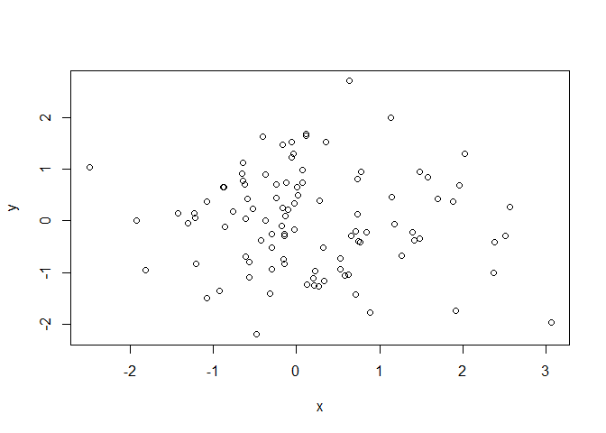
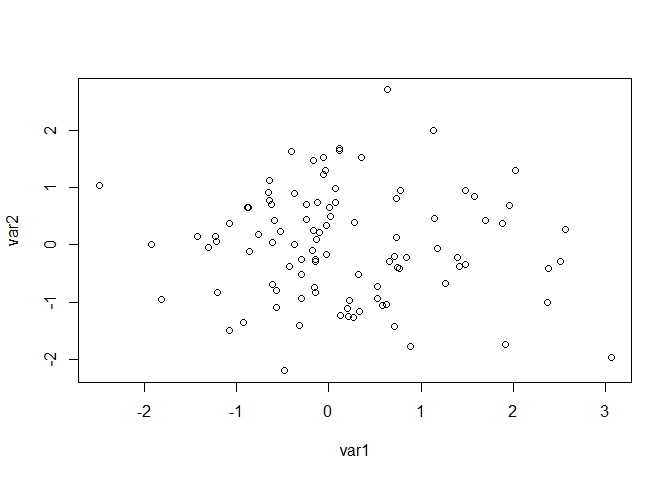
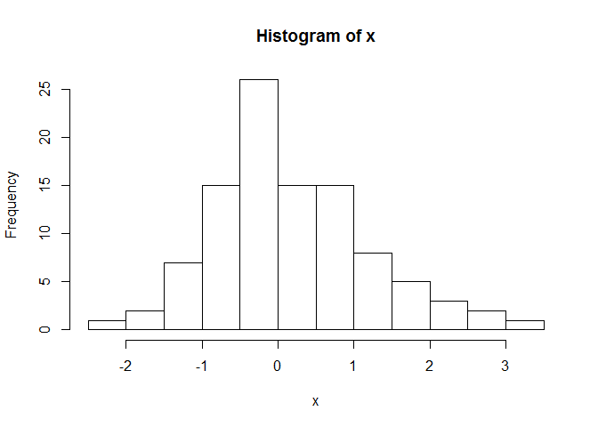
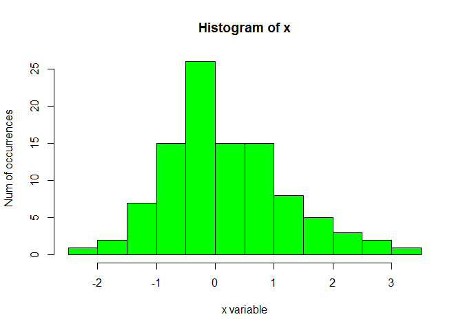
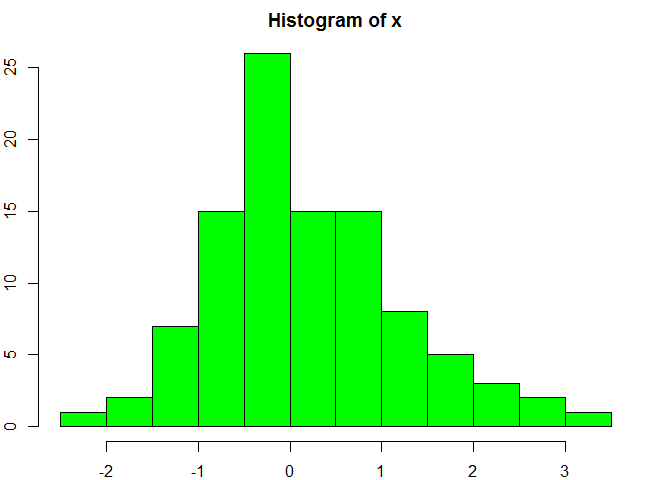
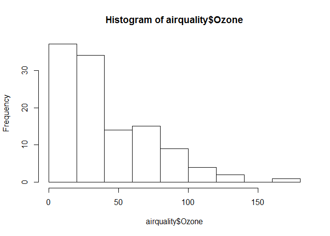

-   [Important Global Parametes](#important-global-parametes)
-   [The base plotting system](#the-base-plotting-system)
    -   [Margins](#margins)
    -   [Histograms](#histograms)

Important Global Parametes
==========================

The graphincs system has global parameters such as, the number of plots in row and column in the plot, the margins, and so on. These parameters affects all the plot in the R session. We can override their default values using `par()` function, and the name of the parameter we want to change:

-   `las`: the orientation of the axis labels on the plot
-   `bg` : the background color
-   `mar`: the margin size
-   `oma`: the outer margin size (default is 0 for all sides)
-   `mfrow`: number of plots per row, column (plots are filled row-wise)
-   `mfcol`: number of plots per row, column (plots are filled column-wise)

To see the default values for a parameter we call `par()` with its name.

``` r
## the default margins
par("mar")
```

    ## [1] 5.1 4.1 4.1 2.1

``` r
## the background color
par("bg")
```

    ## [1] "white"

``` r
## number of plots(we have 1 row and 1 column, then it is one plot)
par("mfrow")
```

    ## [1] 1 1

The base plotting system
========================

The base plotting system starts with an empty canvas, then start drawing on it using **plot** function, which is a function that starts the plot. After that, if you want to annotate the plot or add more to the same plot use **annotation** functions to do that.

**Many base plotting functions share a set of parameters. Here are a few key ones:**

-   `pch`: the plotting symbol (default is open circle)
-   `lty`: the line type (default is solid line), can be dashed, dotted, etc.
-   `lwd`: the line width, specified as an integer multiple
-   `col`: the plotting color, specified as a number, string, or hex code; the colors() function gives you a vector of colors by name
-   `xlab`: character string for the x-axis label

-   `ylab`: character string for the y-axis label

Example, draw a scatter plot for two variables, add a title and x-labels to it. Note that `plot` function here is the function that starts the plot.

``` r
## generate random points for demonstration
x <- rnorm(100)
y <- rnorm(100)

## scatter plot
plot(x,y)
```

 `plot` function sets the axes labels to the given variable names. If we want to change that, we can add `xlab` and `ylab` arguments to the `plot`.

``` r
plot(x,y,xlab = "var1", ylab = "var2")
```



The same goes for **histogram**. To draw a histogrm for **x**, we call `hist` function, which in this case is the function that starts the plot.

``` r
hist(x)
```

 The default y-label is *frequency* and the x-label is the variable name. To change that, add `xlab` and `ylab` just like in `plot`. To make things more interesting, we can also change the bar colors by adding `col`.

``` r
hist(x, xlab = "x variable", ylab = "Num of occurrences", col = "green")
```



Margins
-------

As we can see, each plot has 4 margins around it. Start counting from the bottom and go clock wise to know the index of eah side (bottom = 1, left = 2, top = 3, right = 4). To change the margins, use `par()`.

``` r
## print the default values
par("mar")
```

    ## [1] 5.1 4.1 4.1 2.1

``` r
## reduce them and plot the histogram again
par(mar = c(2,2,2,2))
hist(x, xlab = "x variable", ylab = "Num of occurrences", col = "green")
```



Histograms
----------

``` r
## load datasets
library(datasets)

## we use the default setting for this function
hist(airquality$Ozone) 
```



``` r
## Scatter Plot
data("cars")
with(cars, plot(speed,dist))
```


``` r
## box plot
# airq <- transform(airquality, Month=factor(Month))
# boxplot(ozone~Month, airq, xlab="Month", ylab="ozone(ppb)")
```
