-   [Important Global Parameters](#important-global-parameters)
-   [The base plotting system](#the-base-plotting-system)
    -   [Histograms](#histograms)

Important Global Parameters
===========================

Before we start you need to know that the graphics system has global parameters such as, the number of plots in row and column in the plot, the margins, and so on. These parameters affects all the plots in the R session. We can override their default values using `par()` function, and the name of the parameter we want to change:

-   `las`: the orientation of the axis labels on the plot
-   `bg` : the background color
-   `mar`: the margin size
-   `oma`: the outer margin size (default is 0 for all sides)
-   `mfrow`: number of plots per row, column (plots are filled row-wise)
-   `mfcol`: number of plots per row, column (plots are filled column-wise)

To see the default values for a parameter we call `par()` with its name.

``` r
## the default margins
par("mar")
```

    ## [1] 5.1 4.1 4.1 2.1

``` r
## the background color
par("bg")
```

    ## [1] "white"

``` r
## number of plots(we have 1 row and 1 column, then it is one plot)
par("mfrow")
```

    ## [1] 1 1

The base plotting system
========================

The base plotting system starts with an empty canvas, then start drawing on it using **plot** function, which is a function that starts the plot. After that, if you want to annotate the plot or add more to the same plot use **annotation** functions to do that.

**Base plotting functions are:**

-   `plot`: make a scatterplot, or other type of plot depending on the class of the object being plotted

-   `lines`: add lines to a plot, given a vector x values and a corresponding vector of y values (or a 2-column matrix); this function just connects the dots

-   `points`: add points to a plot

-   `text`: add text labels to a plot using specified x, y coordinates

-   `title`: add annotations to x, y axis labels, title, subtitle, outer margin

-   `mtext`: add arbitrary text to the margins (inner or outer) of the plot

-   `axis`: adding axis ticks/labels

**Many base plotting functions share a set of parameters. Here are a few key ones:**

-   `pch`: the plotting symbol (default is open circle)
-   `lty`: the line type (default is solid line), can be dashed, dotted, etc.
-   `lwd`: the line width, specified as an integer multiple
-   `col`: the plotting color, specified as a number, string, or hex code; the colors() function gives you a vector of colors by name
-   `xlab`: character string for the x-axis label

-   `ylab`: character string for the y-axis label

**Examples**

Draw a scatter plot for two variables, add a title and x-labels to it. Note that `plot` function here is the function that starts the plot.

``` r
## generate random points for demonstration
x <- rnorm(100)
y <- rnorm(100)

## scatter plot
plot(x,y)
```

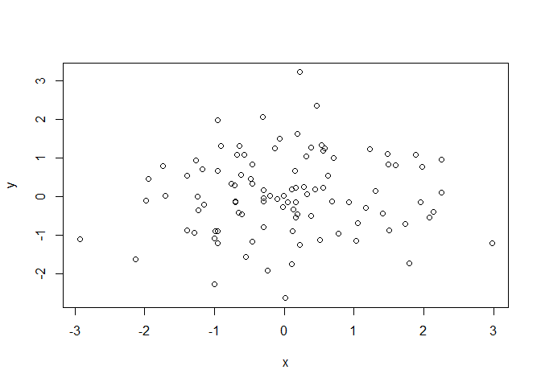

`plot` function sets the axes labels to the given variable names. If we want to change that, we can add `xlab` and `ylab` arguments to the `plot`.

``` r
plot(x,y,xlab = "var1", ylab = "var2")
```

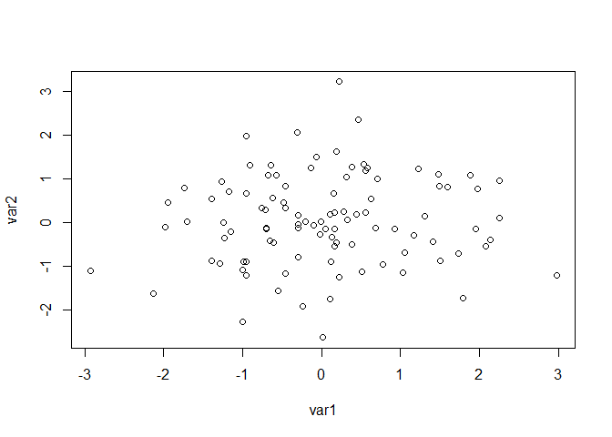

To change the shape of the scatter points use `pch` argument in `plot`. Note that the value 20 makes the points **solid black**,

``` r
plot(x,y,xlab = "var1", ylab = "var2", pch = 20)
```

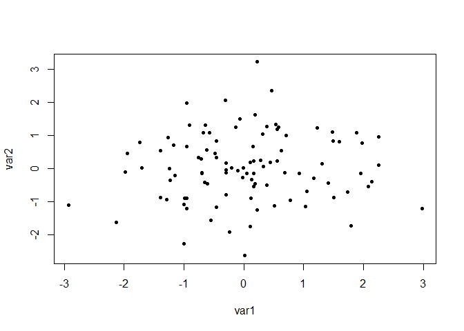

and 19 makes them **bigger solid black**.

``` r
## bigger solid black
plot(x,y,xlab = "var1", ylab = "var2", pch = 19)
```

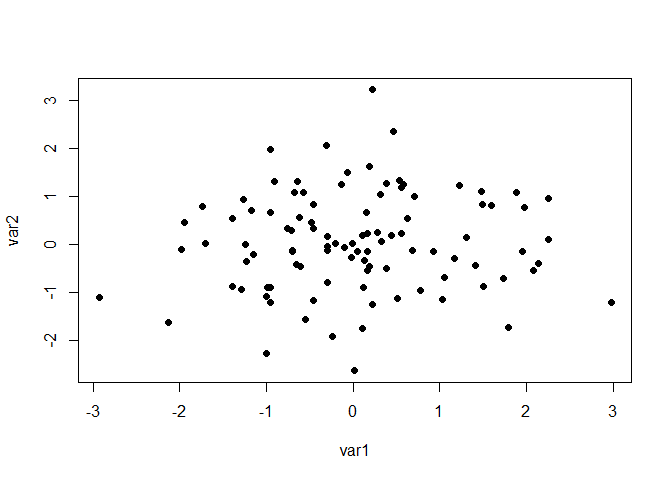

More option are shown in the figure below. You can see the some demos by calling `example("points")`. Note that, for values 21 to 25, you need to specify two colors one for the edge and the other for the filling. 

To add title to the plot, use `title` after calling `plot`

``` r
plot(x,y)
title("Scatter Plot")
```

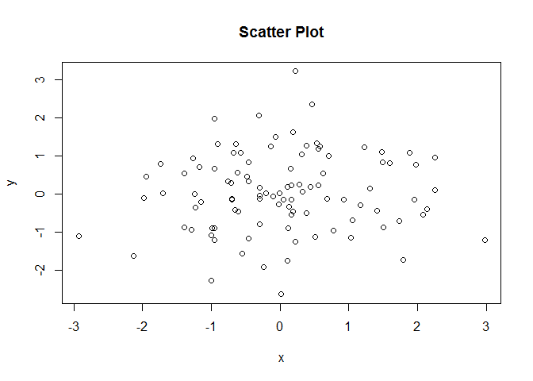 another way to add title by a single line of code is to use `main` argument in `plot`.

``` r
plot(x,y, main = "another way to add title")
```

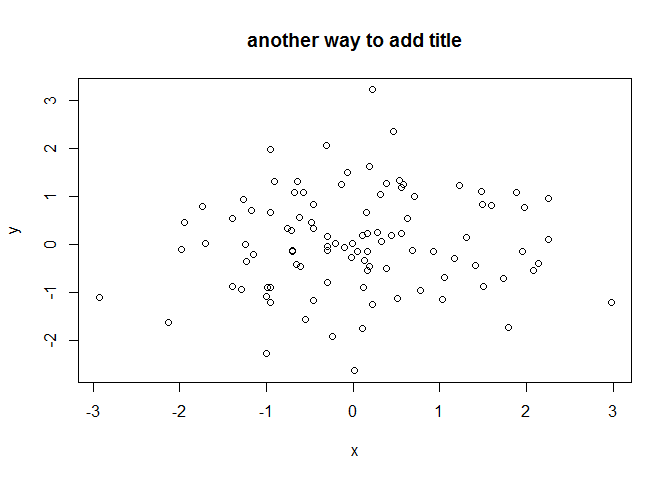

suppose that we want to add a abel at specific point in the plot, use `text`after calling `plot`.

``` r
plot(x,y)
# add label at (0,0)
text(0, 0, "Label")
```

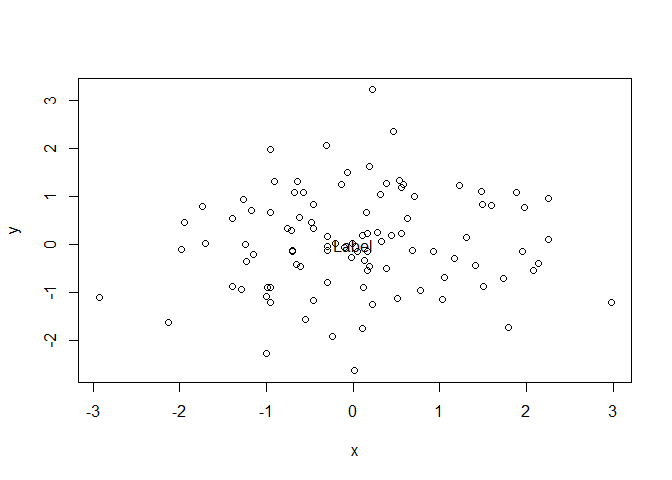

To add a legend use `legend` after calling `plot`.

``` r
plot(x,y)
legend("topright", legend = "some txt", pch = 19)
```

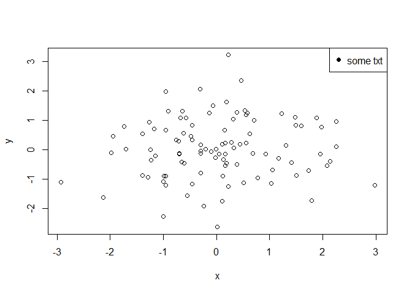

To fit a line to the data, use `lm` function to get the linear model then draw the result. Note that the output from `lm` is the line coefficient( a,b in ax + b), so we use `abline` to draw it.

``` r
z <- x + rnorm(100)
plot(x,z, pch = 19)
lM <- lm(z~x)
## lwd = line width, red color
abline(lM, lwd = 3, col = "red")
```

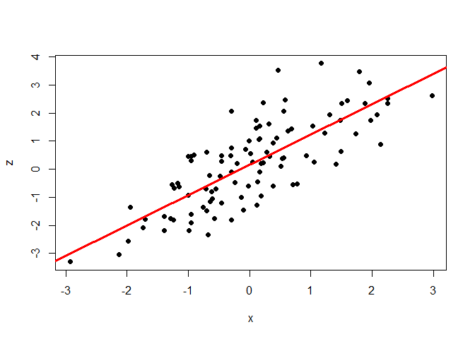

The same goes for **histogram**. To draw a histogram for **x**, we call `hist` function, which in this case is the function that starts the plot.

``` r
hist(x)
```

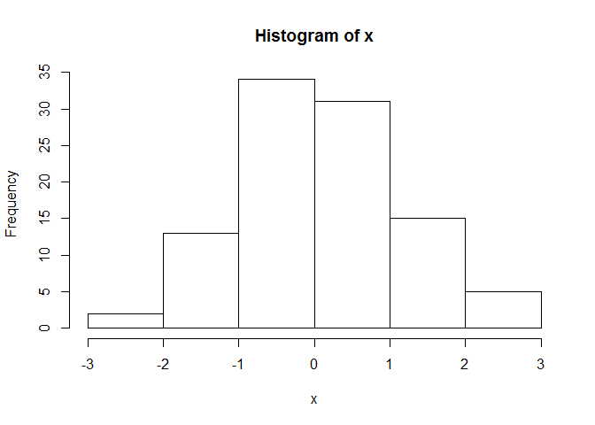

The default y-label is *frequency* and the x-label is the variable name. To change that, add `xlab` and `ylab` just like in `plot`. To make things more interesting, we can also change the bar colors by adding `col`.

``` r
hist(x, xlab = "x variable", ylab = "Num of occurrences", col = "green")
```

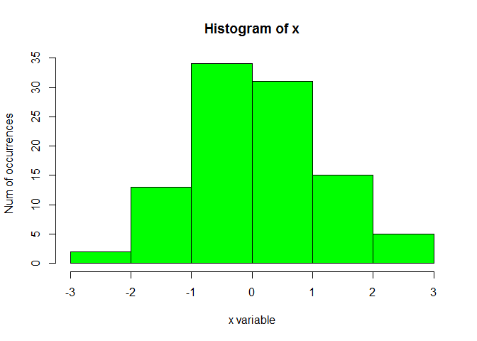

**Margins**

As we can see, each plot has 4 margins around it. Start counting from the bottom and go clock wise to know the index of each side (bottom = 1, left = 2, top = 3, right = 4). To change the margins, use `par()`.

``` r
## print the default values
par("mar")
```

    ## [1] 5.1 4.1 4.1 2.1

``` r
## reduce them and plot the histogram again
par(mar = c(2,2,2,2))
hist(x, xlab = "x variable", ylab = "Num of occurrences", col = "green")
```

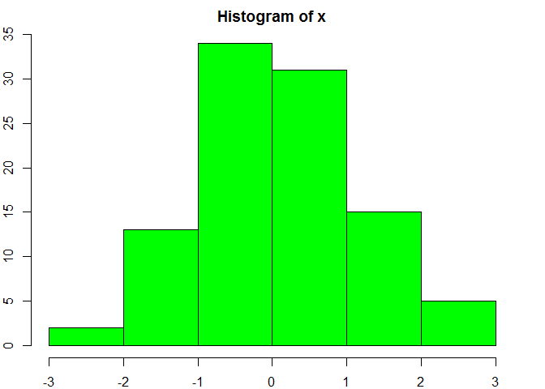

Note that, large margins are necessary for the axes labels to show up.

**Add multiple plots in one big plot**

We can chang the number of rows and columns in the plot by using `par()` function. For example, to stack 2 plot on top of each other, we will need 2 rows and one column.

``` r
par(mfrow = c(2,1))
plot(x,y, main = "plot 1", pch = 19, col = "red")
plot(x,z, main = "plot 2", pch = 19)
```

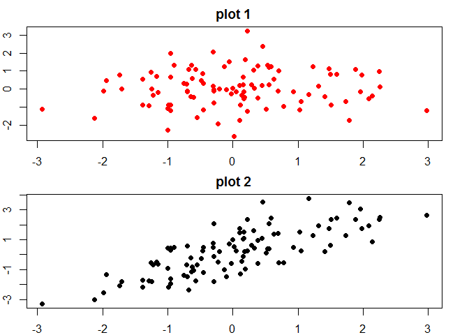

We can play a little with margins to make this plot looks better. We will see that later.

To add the two plots side by side, then use 1 row, 2 columns.

``` r
par(mfrow = c(1,2))
plot(x,y, main = "plot 1", pch = 19, col = "red")
plot(x,z, main = "plot 2", pch = 19)
```


You don't have to specify the location of each plot because they are plotted by the order of their `plot` call.

Another important note is that the difference `mfrow` and `mfcol`, is the order of locations the plot will appear in.

Note the difference between the plot when we use `mfrow` and the other plot when we use `mfcol` to specify the number of rows and columns.

`mfrow` fills the **rows**, and `mfcol` fills the **columns**.

``` r
w  <- x;
par(mfrow = c(2,2), oma = c(0,0,2,0))
plot(x,y, main = "plot 1", pch = 19, col = "red")
plot(x,z, main = "plot 2", pch = 19)
plot(x,w, main = "plot 3", pch = 19, col = "blue")
plot(x,z+y, main = "plot 4", pch = 19, col = "green")
mtext("using mfrow", outer = TRUE, cex = 1.5)
```

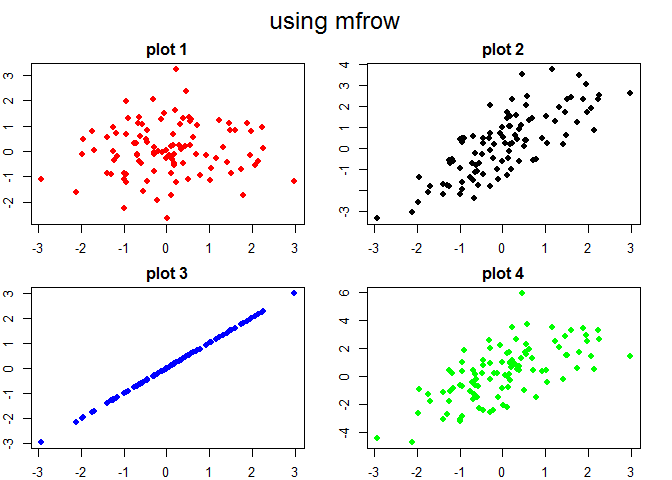

``` r
par(mfcol = c(2,2), oma = c(0,0,2,0))
plot(x,y, main = "plot 1", pch = 19, col = "red")
plot(x,z, main = "plot 2", pch = 19)
plot(x,w, main = "plot 3", pch = 19, col = "blue")
plot(x,z+y, main = "plot 4", pch = 19, col = "green")
mtext("using mfcol", outer = TRUE, cex = 1.5)
```

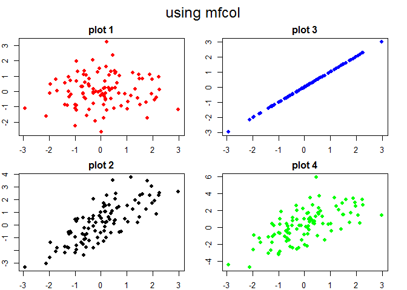

Histograms
----------

``` r
## load datasets
library(datasets)

## we use the default setting for this function
hist(airquality$Ozone) 
```


``` r
## Scatter Plot
data("cars")
with(cars, plot(speed,dist))
```


``` r
## box plot
# airq <- transform(airquality, Month=factor(Month))
# boxplot(ozone~Month, airq, xlab="Month", ylab="ozone(ppb)")
```
